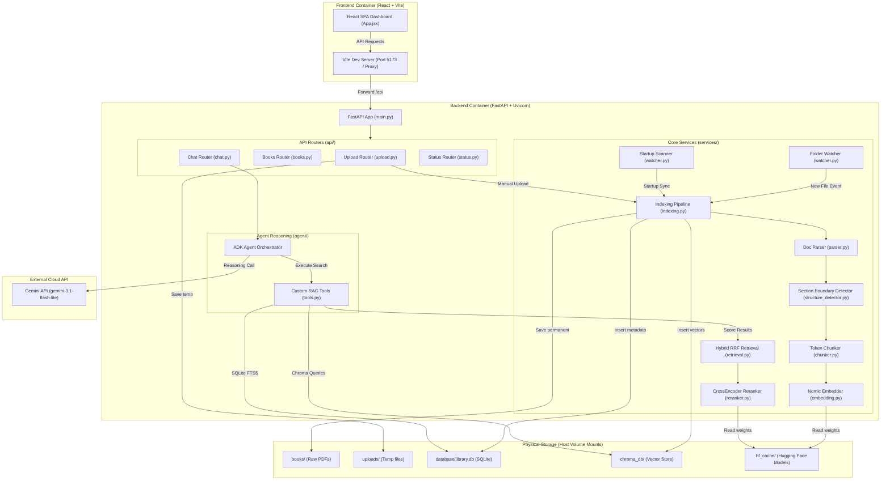
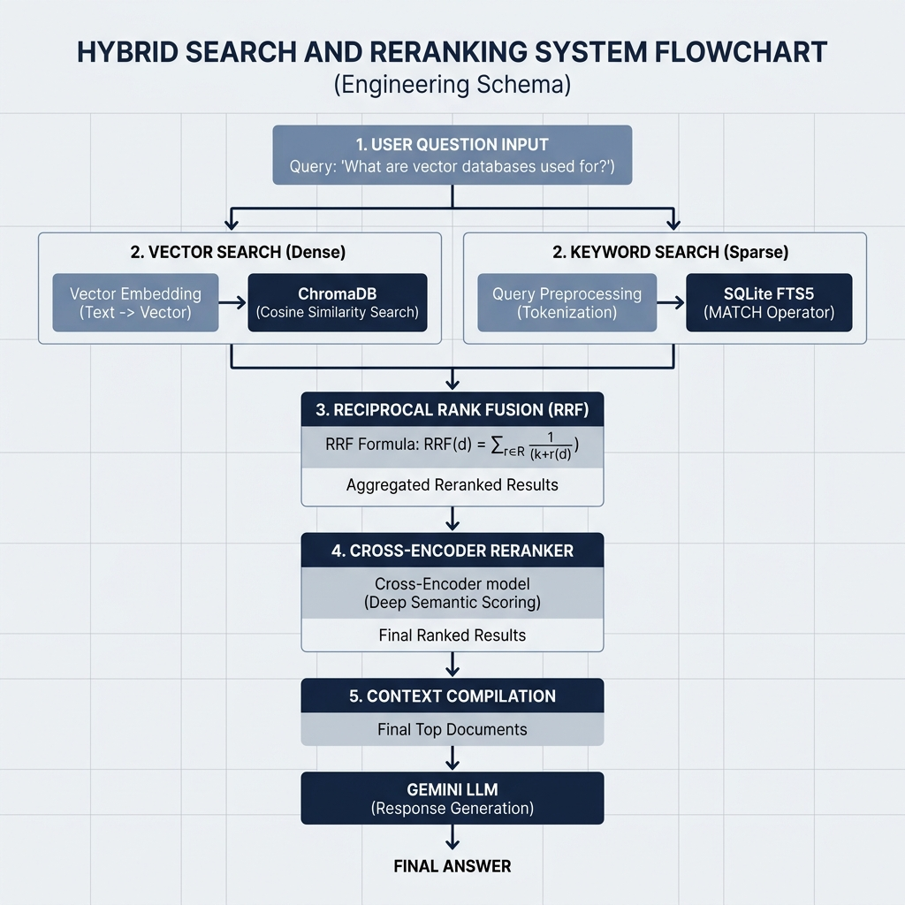

# AI Personal Library
> **A CPU-Optimized Local Retrieval-Augmented Generation (RAG) Platform with Agentic Multi-Session Chat**

---

## 1. Executive Summary & Overview

The **AI Personal Library** is a microservices-based, containerized document management and semantic search platform. The system is designed to run entirely on standard consumer hardware (specifically optimized for **Windows 8GB RAM host CPU profiles**). 

The platform monitors your local directory for incoming document uploads (PDF, DOCX, EPUB, TXT, MD), automatically ingests and parses them page-by-page, detects document structures and layouts, builds overlapping semantic chunks, and indexes them into a dual-search repository (SQLite FTS5 for keyword matches + ChromaDB for semantic concept matches). 

Users query their library through a responsive, premium multi-session React dashboard. The reasoning loop is handled locally by the Google ADK Framework, communicating securely with Google Gemini models.

---

## 2. System Architecture

The platform follows a clean, modular microservices topology orchestrated using **Docker Compose**:



### Key Architectural Highlights:
* **Frontend App (React + Vite):** Runs in a Node.js container, serving the dashboard UI on Port 5173. Includes a reverse proxy for all `/api/*` traffic to bypass CORS restrictions.
* **Backend Server (FastAPI + Uvicorn):** Coordinates index routing, processes upload forms, and manages background worker task queues on Port 8000.
* **Storage Volumes Mount:** Connects your Windows drives directly to the containers. This ensures your index databases, raw book PDFs, and Hugging Face caches persist when containers are stopped or updated.
* **Google ADK Agent Orchestrator:** Interprets user inputs, decides which search tools to execute, gathers context, and streams the compiled answer with exact page citations back to the UI.

---

## 3. The Hybrid Search & Reranking Flow

To achieve high-accuracy retrieval under local CPU constraints, the platform runs a **Hybrid Search Pipeline**:



1. **Vector Semantic Search (ChromaDB):** Converts the query into a 768-dimensional concept vector using the preloaded `nomic-embed-text-v1.5` model, fetching passages closest in cosine distance.
2. **Keyword Search (SQLite FTS5):** Queries a virtual Full-Text Search (FTS5) table to match exact terms.
3. **RRF (Reciprocal Rank Fusion):** Merges the results of both searches mathematically.
4. **Cross-Encoder Reranking:** Evaluates the merged candidate chunks using the `ms-marco-MiniLM-L-6-v2` reranker, sorting the most helpful passages to the top.

---

## 4. Key Features

* **Multi-Session Chat History:** Automatically persists conversations in your browser's `localStorage`. Switch between past conversations in the sidebar, or delete history cards with a trash can icon.
* **Force-Stop Query Processing:** Toggle an `AbortController` in the React frontend. If the model takes too long, click the red **Force Stop** button to cancel the request and reset the load state.
* **Startup Document Scanner:** Automatically scans the `books/` folder on boot, registers new documents, and re-queues incomplete indexing attempts.
* **SQLite WAL Mode Enabled:** Runs database operations using Write-Ahead Logging (WAL) to support concurrent writes from the watcher and uploads without locking.
* **Dynamic Model Normalization:** Programmatic safeguards automatically map deprecated configurations to active Gemini production models (like `gemini-3.1-flash-lite`), preventing 404 connection crashes.

---

## 5. Directory Structure

```text
AI-Personal-Library/
├── backend/
│   ├── api/                   # API sub-routers (upload, books, chat, status)
│   ├── services/              # Core business services (watcher, indexing, database)
│   ├── agent/                 # Google ADK agent logic and RAG tools
│   ├── main.py                # FastAPI entry point
│   ├── requirements.txt       # Python dependencies list
│   └── Dockerfile             # Python slim container spec
├── frontend/
│   ├── src/                   # React components and styling design system
│   ├── package.json           # npm dependencies list
│   └── Dockerfile             # Node alpine container spec
├── books/                     # Watched directory for raw PDF/Doc uploads (gitignore)
├── database/                  # SQLite database directory (gitignore)
├── chroma_db/                 # Chroma HNSW binary graph indexes (gitignore)
├── hf_cache/                  # Cached Hugging Face model weights (gitignore)
├── .env.example               # Template configuration file
├── docker-compose.yml         # Container orchestrator
└── README.md                  # This file
```

---

## 6. Quick Start & Installation

### Prerequisites:
* **[Docker Desktop](https://www.docker.com/products/docker-desktop/)** installed and running.
* **Google Gemini API Key** (Get one for free at **[Google AI Studio](https://aistudio.google.com/)**).

### Step-by-Step Setup:

1. **Clone the repository:**
   ```bash
   git clone https://github.com/Sanketh360/AI-Personal-Library.git
   cd AI-Personal-Library
   ```

2. **Configure your environment:**
   Copy the example template file to create a local `.env` file:
   ```bash
   cp .env.example .env
   ```
   Open the `.env` file and paste your Gemini API key:
   ```env
   GEMINI_API_KEY=your_actual_api_key_here
   ```

3. **Launch the application:**
   Compile the microservices and run the containers in the background:
   ```bash
   docker compose up -d --build
   ```

4. **Access the platform:**
   Open your browser and navigate to **`http://localhost:5173/`** to access the dashboard!

---

## 7. How to Ingest Documents

You can add books to your RAG library in two ways:
* **Manual Upload:** Drag-and-drop or select documents using the upload button inside the Web UI dashboard.
* **Folder Watcher:** Copy, paste, or save documents directly into the local `books/` directory on your computer. The background Watchdog daemon will automatically detect and index them.
